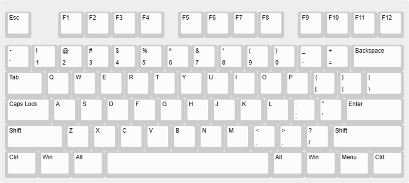

# **K-0**

75% Keyboard with thocky switches. USB-C / BLE connectivity, fully custom 3d printed case + PCB.

## The Idea

Always wanted to design a keyboard for myself. Decided to finally go for it.

After searching online about various keyboards and switches, I realized I love deep thocky-sounding keyboards, so I selected the `Akko Bittersweet` switches. They are tactile switches with an operating force of 48 ± 5gf and tactile force of 60 ± 5gf. ([more switch specs](https://en.akkogear.com/product/bittersweet-switch-lubed/), [sound test](https://www.youtube.com/watch?v=nj9W8xXELII)).

The layout of the keyboard will be 60%, with no separate arrow keys or navigation cluster BUT with an added function keys row.

The microcontroller I have selected for this project is the `MDBT50Q-P1M nRF52840 Based BLE Module` for it's built-in bluetooth capabilities and good support ecosystem for similar projects. This will be paired up with a 1s (3.7V) LiPo battery with a suitable capacity + custom charging circuit which will be good enough for our usecase.

### Keyboard layout (from [keyboard-layout-editor.com](https://keyboard-layout-editor.com)):
